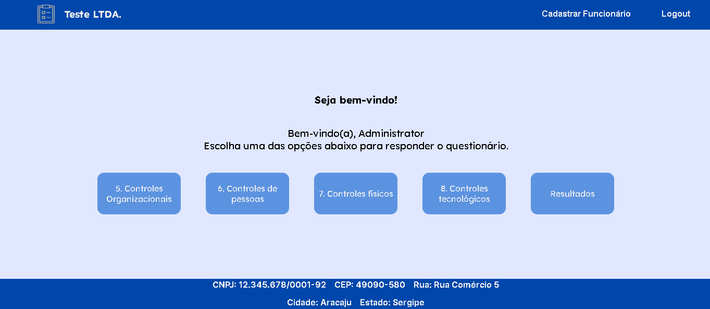

# TCC Audit - ISO/IEC 27002:2022


## Summary
- [About](#about)
- [Technologies](#technologies)
- [Instructions for Use with Docker](#instructions-for-use-with-docker)
- [API Endpoints](#api-endpoints)
- [Screenshots](#screenshots)
- [Troubleshooting](#troubleshooting)
- [Contribution](#contribution)
- [License](#license)
- [Contact](#contact)

## About

The TCC Audit is a tool developed as part of the Course Completion Project (TCC) at FATEC São Caetano do Sul, specifically within the Information Security field. Its main objective is to help organizations assess their maturity in information security best practices, based on the guidelines outlined in the ISO/IEC 27002:2022 standard.

This standard establishes a comprehensive framework consisting of controls, guidelines, and best practices designed to improve information security in organizations. The overall objective is to ensure the confidentiality, integrity, and availability of confidential data.

The creation of the TCC Audit means a commitment to applying the practical knowledge acquired throughout the course. Taking advantage of the principles and insights acquired in the Information Security course at FATEC São Caetano do Sul.

## Technologies
- **Backend:**
  - [Java 21](https://www.oracle.com/java/technologies/downloads/)
  - [Apache Maven](https://maven.apache.org/download.cgi)
- **Database:**
  - [MySQL Server](https://dev.mysql.com/downloads/mysql/)
- **Frontend:**
  - [JavaScript](https://www.javascript.com/)
  - [HTML5](https://www.w3schools.com/html/default.asp)
  - [CSS3](https://www.w3schools.com/css/default.asp)
- **Visualization:**
  - [Grafana](https://grafana.com/grafana/download)
- **Tools:**
  - [Visual Studio Code (VSCode)](https://code.visualstudio.com)
  - [Postman](https://www.postman.com/downloads/)
  - [phpMyAdmin](https://www.phpmyadmin.net/downloads/)
  - [Git](https://git-scm.com/downloads)
  - [Docker](https://docs.docker.com/desktop/install/windows-install/)

## Instructions for Use with Docker

**Prerequisites:**
  - Docker

**Step 1: Install Docker:**
  - Windows:
    - Install [Docker Desktop](https://docs.docker.com/desktop/install/windows-install/)

  - Linux:
    - Install [Docker](https://docs.docker.com/engine/install/ubuntu/)
  
  - macOS:
    - Install [Docker Desktop](https://docs.docker.com/desktop/install/mac-install/)

**Step 2: Clone the Repository:**
  - Clone the repository using the following Git command:
  
    ```bash
    git clone https://github.com/vicentejluz/tcc-audit-27002.git
    ```

**Step 3: Navigate to the Project Directory:**
  - Navigate to the directory where the cloned repository is located:
    
    ```bash
    cd tcc-audit-27002
    ```

**Step 4: Configure and Start the Application:**
  - Create a `.env` file in the root directory of your project:
    ```markdown
      MYSQLDB_DATABASE=`<Database Name>`
      MYSQLDB_ROOT_PASSWORD=`<Database Root User Password>`
      MYSQLDB_USER=`<Database User>`
      MYSQLDB_USER_PASSWORD=`<Database User Password>`
      TOKEN_SECRET=`<JWT Token Secret>`
    ```
  - Start the application using Docker-Compose:
    ```bash
    docker compose up -d
    ```
  - **Optionally**, if you want to rebuild the Docker images during startup:
    ```bash
    docker compose up -d --build
    ```

**Step 5: Access the Frontend Application:**
  - The Frontend will be running at [http://localhost/index.html](http://localhost/index.html)

To access phpMyAdmin, go to [http://localhost:8888/](http://localhost:8888/)

**Note:** If you change the ports for the Backend or Grafana service in the `docker-compose.yml` file, make sure to update them in the frontend **(project view directory)** as well. Modify the following files accordingly:
  - For Backend port, update the `HTTP_PORT` variable in `./view/scripts/module/api.js`.

  - For Grafana port, update the `port` variable in `./view/scripts/module/utils/grafana.js`.

## API Endpoints

For more information, access the [API Documentation](http://localhost:8080/tcc-audit/swagger-ui/index.html). Please note that this link is functional only when the system is running.

The API provides the following endpoints:

- **Employee:**
  -  `/employees` - List all employees. (ADMIN access required)  
  -  `/employee/:id` - Retrieve information about a specific employee based on ID. (all authenticated employees)
  -  `/sign-up` - Register a new employee in the system. (ADMIN access required)
  -  `/is-enabled/:id` - Block or unblock an employee's login. (ADMIN access required)

- **Company:**
  -  `/sign-up-company` - Registers a new company in the system. (Public access, no authentication required.)

- **Authentication:**
  -  `/login` - Performs employee authentication, generating an access token. (Public access, no authentication required.)

- **Evidence:**
  -  `/evidences/:id` - Retrieves information about a specific evidence based on its ID. (all authenticated employees)
  -  `/evidences/download/:id` - Downloads the file associated with a specific evidence. (all authenticated employees)
  -  `/evidences/upload` - Uploads a new evidence to the system. (all authenticated employees)
  -  `/evidences/delete/:id` - Deletes a specific evidence from the system. (all authenticated employees)

- **Answer:**
  -  `/answers/count/:id` - Returns the total count of responses for a specific company. (all authenticated employees)
  -  `/answers/by-topic` - Returns responses organized by topic. (all authenticated employees)
  -  `/answers` - Submits a new response to the system. (all authenticated employees)

- **Address:**
  -  `/via-cep` - Returns address information based on the provided postal code. (public access, no authentication required.)

- **Topic:**
  -  `/topics/:topic` - Returns detailed information about a specific topic. (all authenticated employees)

- **Summary:**
  -  `/summaries/:topic` - Returns a summary related to a specific topic. (all authenticated employees)

- **Question:**
  -  `/questions/summaries/:id` - Returns questions associated with a specific summary. (all authenticated employees)

- **Department:**
  -  `/departments` - Returns information about all departments. (ADMIN access required)

## Screenshots


>*Representation of the logical data model illustrating entities, relationships, and attributes, providing a structured overview of the data structure within the system.*

<br>


>*Home page of the system.*

<br>


>*Registering a new company in the system.*

<br>


>*Logging into the system.*

<br>


>*Overview of the system's dashboard.*

<br>


>*Employee registration page.*

<br>


>*Blocking or unblocking an employee in the system.*

<br>


>*ISO-related questionnaire form for employees to provide information about the company's adherence to ISO standards.*

<br>


>*Pop-up notification displayed upon completing all questionnaire responses.*

<br>


>*Grafana visualization to filter and analyze data from form responses.*

## Troubleshooting:

1. If you encounter the "exec /usr/local/bin/docker-entrypoint.sh: no such file or directory" error when running Docker, it may be due to incorrect line endings in the `docker-entrypoint.sh` file. Follow these steps to fix it:

    - **Fix with text editor or IDE:**

      - **Step 1:** Open the `docker-entrypoint.sh` file in your preferred text editor or IDE.
        
      - **Step 2:** Change the line endings from CRLF (Windows) to LF (Unix). Most text editors have an option to do this in the status bar or the file menu.
        
      - **Step 3:** Save the file and try running the Docker container again.

    - **Fix with command line for Linux:**

      - **Step 1:** Install `dos2unix` (If it is not installed, if it is already installed, skip this step).
        ```bash
        sudo apt-get install dos2unix
        ```

      - **Step 2:** Navigate to the directory where the `docker-entrypoint.sh` file is located:
        ```bash
        cd /path/to/directory/where/the/file/docker-entrypoint.sh/is
        ```

      - **Step 3:** Run `dos2unix` (assuming it's installed):
        ```bash
        dos2unix docker-entrypoint.sh
        ```

      - **Step 4:** Save the file and try running the Docker container again.
  
    This should resolve the "exec /usr/local/bin/docker-entrypoint.sh: no such file or directory" issue.

## Contribution

Contributions are welcome! If you encounter any issues or have suggestions for improvements, please open an issue or submit a pull request to the repository.

## License

This project is licensed under the [MIT License](https://opensource.org/licenses/MIT) - see the [LICENSE](LICENSE) file for more details.

## Contact

<div align="center">
    <a href="https://github.com/vicentejluz" target="blank">
    </a>
    <a href="https://www.linkedin.com/in/vicentejluz" target="blank">
    </a>  
    <a href="https://www.beecrowd.com.br/judge/pt/profile/374484" target="blank">
    </a>
  <br>
</div>
